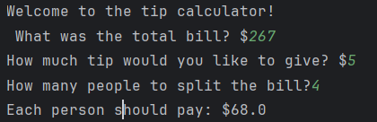

📝 Day 2 - Understanding Data Types and String Manipulation
📌 Today I Learned:
Today, I explored different data types and how to manipulate strings in Python.

🔹 Type Conversion (int(), float(), str())
The int() function converts a float to an integer.

🔹 Exponentiation (**)
The ** operator is used to calculate powers.

🔹 Rounding Numbers (round())
The round() function rounds a number to a specified number of decimal places.

🔹 Using f-strings for String Formatting
F-strings allow variables to be embedded inside strings easily.

Example:
score = 80
height = 1.65
is_winning = True

print(f"Your score is {score}, your height is {height}, and winning status is {is_winning}")

Output:
Your score is 80, your height is 1.65, and winning status is True
📸 Screenshots
I’ve added screenshots of my code execution.

🎯 Summary:
I learned how to manipulate data types, perform calculations, and use f-strings to make printing dynamic!