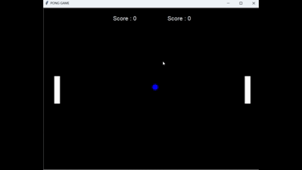

# 🏓 100 Days of Code – Day 22: Pong Game

## 🎯 Goal
- Build a classic Pong Game using Python’s `turtle` module.
- Practice Object-Oriented Programming (OOP) by creating multiple classes.
- Add paddle controls, ball movement, collision detection, and scoring.

## 🛠️ What I Did
- Created a `Paddle` class to represent the left and right paddles.
- Built a `Ball` class that moves across the screen and bounces off walls/paddles.
- Implemented keyboard controls:
  - Right paddle → "Up" and "Down" arrow keys.
  - Left paddle → "W" and "S" keys.
- Added collision detection:
  - Ball bounces when hitting top/bottom walls.
  - Ball bounces when hitting a paddle.
  - If the ball misses a paddle, the opponent scores.
- Created a `Scoreboard` class to keep track of points for both players.

## ✅ Outcome
- A fully functional Pong Game with two-player controls.
- Improved my understanding of collision logic and game loops.
- Strengthened OOP skills by dividing the game into separate, reusable classes:
  - `User`
  - `Ball`
  - `Scoreboard`

## 🎬 Demo GIFs
Here is demo animations from the game:

### Gameplay  

## 🚀 Final Result
- Two players can play Pong using:
  - Player 1 (Left paddle): **W / S keys**
  - Player 2 (Right paddle): **Up / Down arrow keys**
- Score updates dynamically and displays on screen.
- Ball resets to the center after each point.
