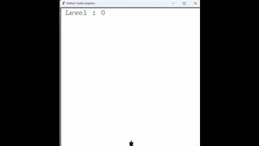

# 🐢 Turtle Crossing Game

This is the **Day 23 project** from the "100 Days of Code: Python Bootcamp".  
A simple arcade-style game built using the `turtle` graphics module.

---

## 🎮 Game Description
The player controls a **turtle** that must cross the road without colliding with moving cars.  
With each successful crossing:
- The player levels up  
- Car speed increases  
- The challenge becomes harder  

The game ends when the turtle collides with a car.

---

## 🛠 Features
- Randomly generated cars in different colors  
- Continuous car movement from right to left  
- Increasing speed as levels go up  
- Collision detection between the player and cars  
- Scoreboard to track levels  
- "Game Over" message when collision happens  

## 🎬 Demo GIFs
Here is demo animations from the game:

### Gameplay  

