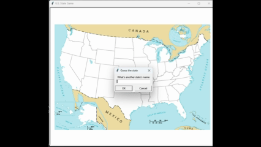

# 🗺️ U.S. States Game

This project is an interactive guessing game where you try to name all **50 U.S. states** on a blank map.  
I built this game to strengthen my skills in **data handling**, **GUI programming**, and **logical problem-solving**.

---

## 📚 What I Learned

- **GUI Programming with turtle**  
  Learned to use the `turtle` library for setting up a basic GUI.  
  Used the screen to display a background map and managed user input with a pop-up text box.

- **Data Handling with pandas**  
  Applied the `pandas` library by loading a `.csv` file into a DataFrame.  
  Extracted state names and coordinates for processing.

- **List Manipulation**  
  Paired `x` and `y` coordinates using `zip` and Python lists for clean data management.

- **Indexing and Logic**  
  Used `.index()` on lists to locate guessed states and map them to coordinates.  
  Displayed guessed state names on the map accordingly.

- **Problem-Solving**  
  Combined `pandas` with Python core data structures to solve challenges in multiple ways.

---

## 🎮 Gameplay Showcase

